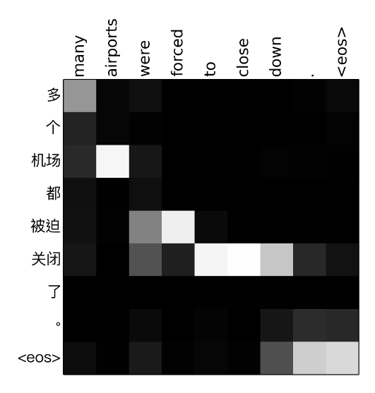
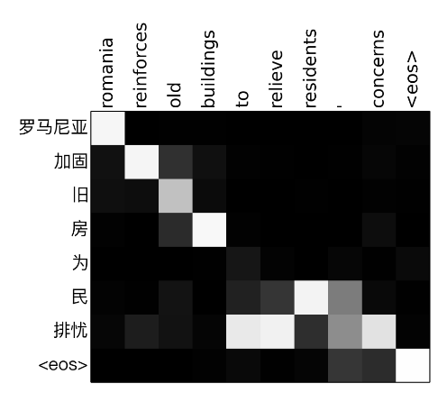

The contents in this post are mainly excerpted from [^1] (original RNN Encoder-Decoder paper), [^2] (original Seq2Seq for neural machine translation paper), and [^3] (original Attention mechanism for Seq2Seq paper).

The meaning of "Encoder-Decoder" and "Sequence to Sequence (Seq2Seq)" are similar, and we do not distinguish between them here.

## RNN Encoder-Decoder

The contents in this section are mainly excerpted from [^1], in which Cho *et al.* (2014) proposed a neural network model/architecture called RNN Encoder-Decoder.

An RNN Encoder-Decoder consists of two recurrent neural networks (RNN) that act as an encoder and a decoder pair. The encoder encodes a variable-length source sequence to a fixed-length vector representation, and the decoder decodes the vector representation back to a variable-length target sequence. The two networks are trained jointly to maximize the conditional probability of the target sequence given a source sequence.

<figcaption style="font-size: 80%;"> Fig. An illustration of the proposed RNN Encoder-Decoder. (Source: Cho et al., 2014) </figcaption>

For a RNN, the hidden state updating can be expressed as 

$$
h_t = f(h_{t-1}, x_t),
$$

and the output is usually

$$
y_t = \text{softmax}(Vh_t),
$$

where $$f$$ is can be as simple as a basic RNN unit i.e. $$h_t = \text{acti}(Uh_{t-1}+Wx_t)$$, and as complex as a LSTM unit or GRU. Here $$\text{acti}$$ is a activation function and $$U, V, W$$ are trained weights. 

As for the RNN Encoder-Decoder, the encoder is a RNN that reads each symbol of an input sequence $$\mathbf{x}$$ sequentially. As it reads each symbol, the hidden state of the encoder changes according to 

$$
h_t = f(h_{t-1}, x_t).
$$

After reading the end of the sequence (marked by an end-of-sequence symbol), the final hidden state of the encoder is a summary $$\mathbf{c}$$ of the whole input sequence, and it is a fixed-length vector representation as mentioned before. 

The decoder is another RNN that generates the output sequence by predicting the next symbol sequentially, with $$\mathbf{c}$$ as the initial hidden state, i.e. $$s_0 = \mathbf{c}$$. The hidden state updating and the output of decoder can be expressed as

$$
s_t = f(s_{t-1}, y_{t-1}, \mathbf{c}), \\
y_t = \text{softmax}(V s_t).
$$

The fixed-length vector representation $$\mathbf{c}$$ is the final hidden state of the encoder and the initial hidden state of the decoder.

## RNN Encoder-Decoder with Attention

Bahdanau *et al.* (2015) [^2] conjectured that the use of a fixed-length vector is a bottleneck in improving the performance of the basic RNN Encoder-Decoder architecture, since it is hard to compressing all the necessary information of a source sentence, especially for a long source sentence. 

To address this issue, they proposed an extension to the basic RNN Encoder-Decoder which learns to align and translate jointly. That is, they implement a mechanism of **attention** to automatically (soft-)search for parts of a source sentence that are relevant to predicting a target word. This approach does not attempt to encode a whole input sentence into a single fixed-length vector. Instead, it encodes the input sentence into a sequence of vectors, and chooses a subset of these vectors adaptively, i.e. (soft-)aligning or (soft-)searching, while decoding.

<figcaption style="font-size: 80%;">(Source: Bahdanau et al., 2015)</figcaption>

The hidden state updating of decoder can be expressed as 

$$
s_t = f(s_{t-1}, y_{t-1}, c_t).
$$

Note that here each $$s_t$$ is conditioned on each distinct context vector $$c_t$$, which depends on a sequence of annotations $$(h_1,\cdots,h_{T_x})$$ to which an encoder maps the input sentence $$(x_1, \cdots, x_{T_x})$$. 

Each annotation $$h_t$$ contains information about the whole input sequence with a strong focus on the parts surrounding the $$t$$-th word $$x_t$$ of the input sequence. 

The context vector $$ c_{t} $$ is, then, computed as a weighted sum of these annotations $$(h_1,\cdots,h_{T_x})$$:

$$
c_{t} = \sum_{j=1}^{T_{x}} \alpha_{tj} h_{j}.
$$

The weight $$ \alpha_{tj} $$ of each annotation $$ h_{j} $$ is computed by

$$
\alpha_{t j}=\frac{\exp \left(e_{t j}\right)}{\sum_{k=1}^{T_{x}} \exp \left(e_{t k}\right)},
$$

where

$$
e_{t j} = a\left(s_{t-1}, h_{j}\right),
$$

is an alignment model which scores how well the inputs around position $$ j $$ and the output at position $$ t $$ match. The score is based on the RNN hidden state $$ s_{t-1} $$ and the $$ j $$-th annotation $$ h_{j} $$ of the input sentence.

The alignment model $$a$$ is parametrized as a feedforward neural network which is jointly trained with all the other components of the proposed system.

We can understand the approach of taking a weighted sum of all the annotations as computing an expected annotation, where the expectation is over possible alignments. Let $$ \alpha_{t j} $$ be a probability that the target word $$ y_{t} $$ is aligned to, or translated from, a source word $$ x_{j} . $$ Then, the $$ i $$-th context vector $$ c_{t} $$ is the expected annotation over all the annotations with probabilities $$ \alpha_{t j} $$.

The probability $$ \alpha_{t j} $$, or its associated energy $$ e_{t j} $$, reflects the importance of the annotation $$ h_{j} $$ with respect to the previous hidden state $$ s_{t-1} $$ in deciding the next state $$ s_{t} $$ and generating $$ y_{t} . $$ Intuitively, this implements a mechanism of attention in the decoder. The decoder decides parts of the source sentence to pay attention to. By letting the decoder have an attention mechanism, we relieve the encoder from the burden of having to encode all information in the source sentence into a fixed length vector. With this new approach the information can be spread throughout the sequence of annotations, which can be selectively retrieved by the decoder accordingly.

Read the appendix A in the paper [^2] for detail description and math expression of the model architecture.

## Tips

### Reversing the Source Sentences

Sutskever *et al.* (2014) [^3] found that reversing the order of the words in all source sentences (but not target sentences) improved the LSTM's performance markedly, because doing so introduced many short term dependencies between the source and the target sentence which made the optimization problem easier. As a result, SGD could learn LSTMs that had no trouble with long sentences.

Normally, when we concatenate a source sentence with a target sentence, each word in the source sentence is far from its corresponding word in the target sentence. As a result, the problem has a large "minimal time lag". By reversing the words in the source sentence, the average distance between corresponding words in the source and target language is unchanged. However, the first few words in the source language are now very close to the first few words in the target language, so the problem's minimal time lag is greatly reduced. Thus, backpropagation has an easier time "establishing communication" between the source sentence and the target sentence, which in turn results in substantially improved overall performance.

It is notable that Sutskever *et al.* (2014) [^3] also found that LSTMs trained on reversed sentences lead to better predictions in both early and latter parts of the target sentences.

### Bidirectional RNN as Encoder For Annotating Source Sequences

Bahdanau *et al.* (2015) [^2] also proposed to use a bidirectional RNN (BiRNN) as the encoder to make the annotation $$h_j$$ of each word to summarize not only the preceding words $$(x_1, \cdots, x_{j})$$, but also the following words $$(x_j, \cdots, x_{T_x})$$.

A BiRNN consists of forward and backward RNN's. The forward RNN $$ \overrightarrow{f} $$ reads the input sequence as it is ordered (from $$ x_{1} $$ to $$ \left.x_{T_{x}}\right) $$ and calculates a sequence of forward hidden states $$ \left(\overrightarrow{h}_{1}, \cdots, \overrightarrow{h}_{T_{x}}\right) $$. The backward RNN $$ \overleftarrow{f} $$ reads the sequence in the reverse order (from $$ x_{T_{x}} $$ to $$ \left.x_{1}\right) $$, resulting in a sequence of backward hidden states $$ \left(\overleftarrow{h}_{1}, \cdots, \overleftarrow{h}_{T_{x}}\right) $$.

We obtain an annotation for each word $$ x_{j} $$ by concatenating the forward hidden state $$ \overrightarrow{h}_{j} $$ and the backward one $$ \overleftarrow{h}_{j} $$, i.e., $$ h_{j}=\left[\overrightarrow{h}_{j}^{T} ; \overleftarrow{h}_{j}^{T}\right]^{T} $$. In this way, the annotation $$ h_{j} $$ contains the summaries of both the preceding words and the following words. Due to the tendency of RNNs to better represent recent inputs, the annotation $$ h_{j} $$ will be focused on the words around $$ x_{j} . $$ This sequence of annotations is used by the decoder and the alignment model $$a$$ later to compute the context vector.

### Attention Weight Matrix ($$\alpha_{tj}$$'s) 

A nice subproduct of attention mechanism is the weight matrix. 

<figure>

<figcaption style="font-size:80%;"> Fig: Attention weight matrix examples for translation from Chinese to English. (Source: <a href="https://arxiv.org/abs/1601.04811">Tu et al., 2016</a>) </figcaption>
</figure>

[To be continued]

 

**References**: 

[^1]: Cho, Kyunghyun, et al. "Learning phrase representations using RNN encoder-decoder for statistical machine translation." *arXiv preprint arXiv:1406.1078* (2014).

[^2]: Bahdanau, Dzmitry, Kyunghyun Cho, and Yoshua Bengio. "Neural machine translation by jointly learning to align and translate." arXiv preprint arXiv:1409.0473 (2015).

[^3]: Sutskever, Ilya, Oriol Vinyals, and Quoc V. Le. "Sequence to sequence learning with neural networks." *Advances in neural information processing systems*. 2014.