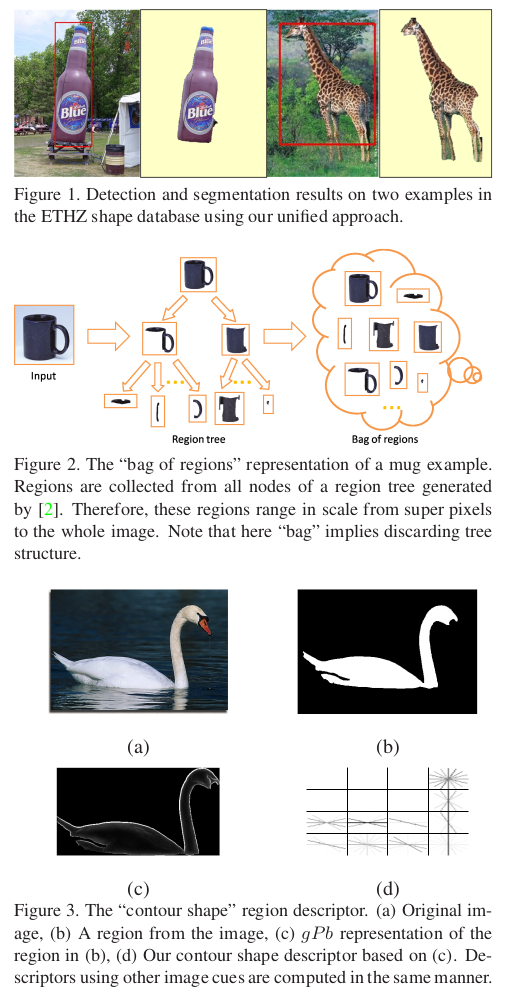
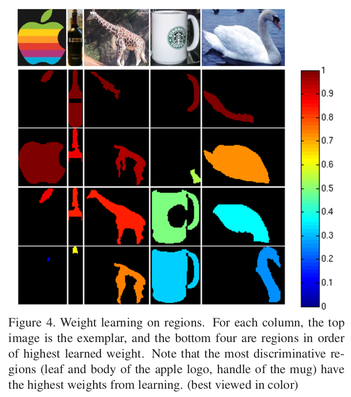

The contents in this post are excerpted from the paper "Recognition using regions" [^1].

This paper presents a unified framework for object detection, segmentation, and classification using regions. Region features are appealing in this context because: (1) they encode shape and scale information of objects naturally; (2) they specify the domains on which to compute various features, without being affected by clutter from out-side the region.

The pipeline of this region-based recognition framework is as follows: 

1. Each image is represented by a bag of regions derived from a region tree as shown in Figure 2;
2. Regions are described by a rich set of cues (shape, color and texture) inside them;
3. Region weights are learned using a discriminative max-margin framework;
4. A generalized Hough voting scheme is applied to cast initial hypotheses of object locations, scales, and support based on region matching;
5. These hypotheses are then refined through a verification classifier and a constrained segmenter, respectively, to obtain final detection and segmentation results.

### Region Extraction

The authors start by constructing a region tree using the hierarchical segmentation engine by [Arbelaez et al. (2009)](https://ieeexplore.ieee.org/abstract/document/5206707/). The regions the authors consider are the nodes of that tree, including the root which is the entire image. The authors use them as the basic entities for this approach.

<figcaption style="font-size: 80%;"> (source: Gu et al., 2009) </figcaption>

### Region Description

The authors describe a region by subdividing evenly its bounding box into an $$ n \times n $$ ($$ 4 \times 4 $$ in the paper) grid, as illustrated in Figure 3. Each cell encodes information only inside the region. The different region cues the authors capture from the cells are: contour shape, edge shape, color, and texture.

### Discriminative Weight Learning

Not all regions are equally significant for discriminating an object from another. For example, wheel regions are more important than uniform patches to distinguish a bicycle from a mug. Here, the authors adapt the framework by [Frome et al. (2006)](https://proceedings.neurips.cc/paper/2006/hash/9f8684e630c4c30cad7b1f0935cd62ab-Abstract.html) for learning region weights.

<figcaption style="font-size: 80%;"> (source: Gu et al., 2009) </figcaption>

### Voting

The goal here, given a query image and an object category, is to generate hypotheses of bounding boxes and (partial) support of objects of that category in the image. (I don't understand yet)

### Verification

A verification classifier is applied to each bounding box hypothesis from voting. (I don't understand yet)

### Segmentation

The segmentation task we consider is that of precisely extracting the support of the object. (I don't understand yet)

 

**Reference:**

[^1]: Gu, Chunhui, Joseph J. Lim, Pablo Arbeláez, and Jitendra Malik. "Recognition using regions." In *2009 IEEE Conference on computer vision and pattern recognition*, pp. 1030-1037. IEEE, 2009.
