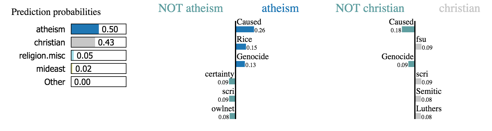
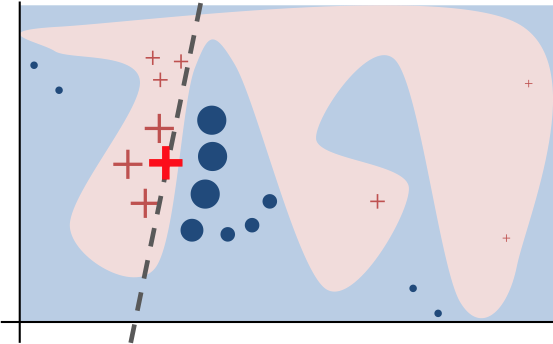

The following sections are excerpted from the paper "Why should I trust you? Explaining the predictions of any classifier." [^1].

## Introduction

Despite widespread adoption, machine learning models remain mostly black boxes. Understanding the reasons behind predictions is, however, quite important in assessing trust. There are two dierent (but related) definitions of trust: (1) trusting a prediction, i.e. whether a user trusts an individual prediction sufficiently to take some action based on it, and (2) trusting a model, i.e. whether the user trusts a model to behave in reasonable ways if deployed. Both are directly impacted by how much the human understands a model’s behaviour, as opposed to seeing it as a black box.

**Local Interpretable Model-Agnostic Explanations** ([**LIME**](https://github.com/marcotcr/lime/)) is a technique to explain the predictions of any machine learning classifier. LIME treats the model as a black box so that it works for any model. **We generate an explanation by approximating the underlying model *locally* by an interpretable one** (such as a linear model with only a few non-zero coefficients), **learned on perturbations of the original instance** (e.g., removing words or hiding parts of the image). 

<figure>

<figcaption style="font-size: 80%;"> Figure. LIME multiclass example. </figcaption>
</figure>

We can use LIME for several purposes: deciding if we should trust a prediction, choosing between models, improving an untrustworthy classifier, and identifying why a classifier should not be trusted.

## Local Interpretable Model-Agnostic Explanations

### Intuition

The key intuition behind LIME is that it is much easier to approximate a black-box model by a simple model *locally* (in the neighborhood of the prediction we want to explain), as opposed to trying to approximate a model globally. This is done by weighting the perturbed instances by their similarity to the instance we want to explain.

<figure>

<figcaption style="font-size: 80%;"> Figure. Toy example to present intuition for LIME. The black-box model’s complex decision function f (unknown to LIME) is represented by the blue/pink background, which cannot be approximated well by a linear model. The bold red cross is the instance being explained. The other red crosses and blue circles are LIME samples instances, gets predictions using f, and weighs them by the proximity to the instance being explained (represented here by size). The dashed line is the learned explanation that is locally (but not globally) faithful. </figcaption>
</figure>

### Interpretable Data Representations

It is important to distinguish between features and interpretable data representations. Interpretable explanations need to use a representation that is understandable to humans, regardless of the actual features used by the model. For example, a possible interpretable representation for text classification is a binary vector indicating the presence or absence of a word. Likewise for image classification, an interpretable may be a binary vector indicating the "presence" or "absence" of a contiguous patch of similar pixels (a super-pixel).

We denote $$x \in \mathbb{R}^d$$ be the original representation of an instance being explained, and we use $$x' \in \{0, 1\}^{d'}$$ to denote a binary vector for its interpretable representation.

### Sampling for Local Exploration

We sample instances around $$x'$$ by drawing nonzero elements of $$x'$$ uniformly at random (where the number of such draws is also uniformly sampled). Given a perturbed sample $$z' \in \{0, 1\}^{d'}$$ (which contains a fraction of the nonzero elements of $$x'$$), we recover the sample in the original representation $$z ' \in \mathbb{R}^d$$ and obtain $$f(z)$$, which is used as a label for the explanation model. Given this sampled dataset $$\mathcal{Z} = \{(z'_i,f(z_i))\}_{i=1}^m$$ of $$m$$ perturbed samples $$z_i$$ with the associated labels $$f(z_i)$$, we train an interpretable model (such as linear models, decision trees etc.).

### Sparse Linear Explanations

We use a similarity kernel to evaluate the similiarity between $$x$$ and $$z$$. We set the similarity kernel as $$π_x(z) = \exp(−D(x,z)^2/σ^2)$$, which is an exponential kernel defined on some distance function $$D$$ (e.g. cosine distance for text, L2 distance for images) with width $$σ$$.

Here, we use Lasso as the regularization version of the interpretiable model. We first select $$K$$ features with Lasso and then learning the weights via least squares (a procedure we call K-Lasso in Algorithm 1).

**Algorithm 1. Sparse Linear Explanations using LIME.**

[1] Require: Classifier $$f$$; Number of LIME samples $$m$$; Instance $$x$$, and its interpretable version $$x'$$; Similarity kernel $$\pi_x(\cdot)$$; Length of explanation $$K$$.

[2] Initialize $$\mathcal{Z} \gets \{\}$$.

[3] For $$i=1$$ to $$m$$ do (a) and (b):

(a) $$z_i' \in \{0,1\}^{d'} \gets \text{SampleAround}(x')$$;

(b) $$\mathcal{Z} \gets \mathcal{Z} \cup (z'_i, f(z_i))$$ with weight $$\pi_x(z_i)$$.

[4] Return $$K$$ coefficients $$w \gets \text{K-Lasso}(\mathcal{Z})$$, with $$z'_i$$ as features, $$f(z_i)$$ as target, and $$\pi_x(z_i)$$ as weight. 

 

**References:**

[^1]: Ribeiro, M. T., Singh, S., & Guestrin, C. (2016, August). "Why should I trust you?" Explaining the predictions of any classifier. In *Proceedings of the 22nd ACM SIGKDD international conference on knowledge discovery and data mining* (pp. 1135-1144).