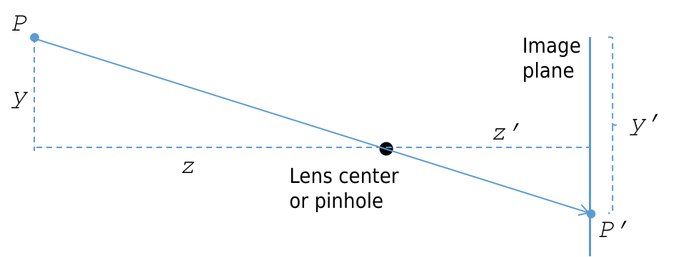

[Course Notes 1: Camera Models](https://web.stanford.edu/class/cs231a/course_notes/01-camera-models.pdf)

## 2 Pinhole cameras

As the aperture size decreases, the image gets sharper, but darker.

## 3 Cameras and lenses

In modern cameras, the above conflict between crispness and brightness is mitigated by using lenses.

A 3D point at further distance in front of the lens result in rays converge to a closer point behind the lens.

Because the paraxial refraction model approximates using the thin lens assumption, a number of aberrations can occur. The most common one is referred to as radial distortion, which causes the image magnification to decrease or increase as a function of the distance to the optical axis. We classify the radial distortion as pincushion distortion when the magnification increases and barrel distortion (e.g. fish-eye lenses) when the magnification decreases. Radial distortion is caused by the fact that different portions of the lens have differing focal lengths.

<figure>

<figcaption style="font-size: 80%;"> Figure: Radial distortion (<a href="https://www.image-engineering.de/library/image-quality/factors/1062-distortion">Source</a>)</figcaption>
</figure>

## 4 Going to digital image space

As discussed earlier, a point $$ P $$ in 3D space can be mapped (or projected) into a 2D point $$ P' $$ in the image plane $$ \Pi' $$. This $$ \mathbb{R}^3 \to \mathbb{R}^2 $$ mapping is referred to as a projective transformation.

<figcaption style="font-size: 80%;"> Figure: Camera model sketch </figcaption>

### 4.1 The Camera Matrix Model and Homogeneous Coordinates

#### 4.1.1 Introduction to the Camera Matrix Mode

The camera matrix model describes a set of important parameters that affect how a world point $$ P $$ is mapped to image coordinates $$ P' $$.

$$
P^{\prime}=\left[\begin{array}{l}
x^{\prime} \\
y^{\prime}
\end{array}\right]=\left[\begin{array}{l}
k z' \frac{x}{z}+c_x \\
l z' \frac{y}{z}+c_y
\end{array}\right]=\left[\begin{array}{l}
\alpha \frac{x}{z}+c_x \\
\beta \frac{y}{z}+c_y
\end{array}\right],
$$

where,

* $$x', y'$$ are coordinates of a image point $$ P' $$ in digital image coordinates; they have units like "pixel".
* $$ z' $$ are distance between image plane and lens center; it has unit like "cm";
* $$x, y, z$$ are coordinates of a world point $$ P $$ in world coordinates; they have units like "cm";
* $$ c_x, c_y $$ are coordinates translation offsets; they have units like "pixel"; they are offsets between digital image coordinates (top left origin) and image plane coordinates (center origin); they equal to half digital image width and height.
* $$ k, l $$​ are pixel density; they have units like "pixels per inch (ppi) or pixels per cm"; they may be different because the aspect ratio of a pixel is not guaranteed to be one; if they are equal, we often say that the camera has square pixels.

#### 4.1.2 Homogeneous Coordinates

