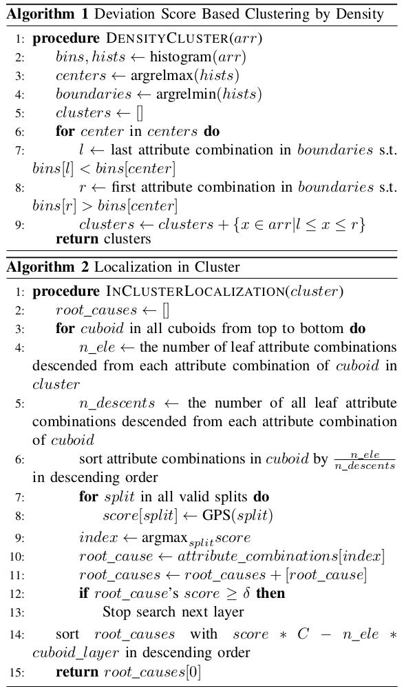

The contents in this post are excerpted from the paper "Generic and robust localization of multi-dimensional root causes." [^1].

### Introduction

Suppose there are $ d $ attributes and each attribute has $ l $ distinct values, then there can be $ \sum_{i=1}^{d}\left(\begin{array}{l}d \\ i\end{array}\right) l^{i}=(l+1)^{d}-1 $ valid attribute combinations and the number of potential root cause can be $ 2^{(l+1)^{d}-1}-1 $. According to the experiences of operators that we worked with, typically $ d $ is less than or about ten, $ l $ is several tens. When $ d=5 $ and $ l=10 $, then there will be $ 2^{161050}-1 $ potential root causes.

Our design goals for multi-dimensional root cause localization are generic and robust: 1) consistently handle fundamental and derived measures; 2) handle both significant and insignificant anomaly magnitudes; 3) do not require parameter fine-tuning; 4) be consistently fast, and 5) have no impractical root cause assumptions. The core ideas and major contributions of our proposed approach, Squeeze, are the following.

There are mainly two challenges for root cause localization problem.

1. How to measure the potential of an attribute combination set to be the root cause?

2. How to design the searching and pruning strategy to localize the root cause from a huge search space?

For the first challenge, the author proposed **generalized potential score** (**GPS**), which is based on **generalized ripple effect** (**GRE**). 

For the second challenge, Squeeze first searches **bottom-up** to narrow down the search space, within which Squeeze then does **top-down** search to localize the root cause attribute combinations.

Case studies in several banks and an Internet company show that Squeeze can localize root causes much more rapidly and accurately than traditional manual analysis. 

### Background

Table V lists the the definitions, notations, and examples of the important terms used in the paper. 

<figure>

<figcaption style="font-size:80%;"> TABLE V: Summary of Terms (<a href="https://www.semanticscholar.org/paper/Generic-and-Robust-Localization-of-Root-Causes-Li-Pei/8b5c1afef9e680b6721b8557931001592be0b2d5">Source</a>) </figcaption>
</figure>

An attribute combination is considered abnormal for a given time window if its real value deviates significantly enough from its expected value.

Without loss of generality, we assume both $v$ and $f$ are non-negative. 

For a derived measure, a non-leaf attribute combination's real (forecast) value is the function of its corresponding fundamental measures' values for this attribute combination, i.e., if $ v=h\left(v_{1}, \ldots, v_{n}\right) $, then $ v(e)=h\left(v_{1}(e), \ldots, v_{n}(e)\right) $, where $ v $ is a derived measure from fundamental measures $ \left\{v_{1}, v_{2}, \ldots, v_{n}\right\} $ and $ h(\cdot) $ is the function that produces $ v $. For convenience, we slightly extend the definition of operator $ v $ and $ f . $ If $ S $ is a set of attribute combinations which are in the same cuboid, and the measure is a fundamental measure, $ v(S)=\sum_{e \in S} v(e) $ and $ f(S)=\sum_{e \in S} f(e) . $ If it is a derived measure, $ v(S)=h\left(v_{1}(S), \ldots, v_{n}(S)\right) $ and $ f(S)=h\left(f_{1}(S), \ldots, f_{n}(S)\right) $.

### Generalized Ripple Effect

The author proposed **generalized ripple effect** (**GRE**), which captures magnitude relationship between the root cause attribute combinations and its "descendant" attribute combinations. 

GRE has two major differences from the the ripple effect (RE): 

1. RE holds only for fundamental measures, but GRE holds for a derived measure as long as RE holds for its underlying fundamental measures; 
2. RE does not work for zero forecast values (not uncommon in practice), but GRE works.

#### Background of Ripple Effect

The intuition of ripple effect is that **all attribute combinations affected by the same root cause will change by the same proportion.** It says that, given a root cause $ S $, which is a subset of cuboid $ C $, the abnormal magnitude of any affected attribute combination $ e $ (in $ S $ or descended from any attribute combination in $ S $) satisfies the following equation:
$$
\frac{f(e)-v(e)}{f(e)}=\frac{f(S)-v(S)}{f(S)} \tag{1}
$$
where $ f(S)(v(S)) $ denotes the total forecast (real) value of all leaf attribute combinations in $ S . $ 

#### Generalizing Ripple Effect for Derived Measures

Consider three measures, $ M_{1}, M_{2}, M_{3} $, where $ M_{1} $ and $ M_{2} $ are fundamental measures and $ M_{3}=\frac{M_{1}}{M_{2}} $ (or $ M_3 = M_1 \times M_2 $). Since $ M_{1} $ and $ M_{2} $ are fundamental measures, $ M_{1} $ and $ M_{2} $ satisfies ripple effect. It can be proved the $ M_{3} $ also satisfies ripple effect. 

The core idea of the proof is finite difference. A similar method can be applied when dealing with other types of derived measures.

####  Generalizing Ripple Effect for Zero Forecast Values

The ripple effect in [7] does not work for zero forecast values (i.e., $ f(S)=0 $. To avoid this problem, we replace $ f $ with $ \frac{f+v}{2} $. That is to say, GRE's formulation becomes
$$
\frac{f(e)-v(e)}{f(e)+v(e)}=\frac{f(S)-v(S)}{f(S)+v(S)} \tag{2}
$$
where the symbols have the same meaning as (1). If (1) holds, then it is obvious that (2) holds as well; if $ f(S)=0 $, then any affected attribute combination $ e $ should have infinitely large abnormal magnitudes or $ f(e)=0 $.

### Squeeze Approach

#### Scope of this Paper

The input of Squeeze are a measure's real and forecast values of all leaves. 

There are two steps in Squeeze:

1. Bottom-up: Clustering.
2. Top-down: Locating in each cluster.

The output of Squeeze is a set of attribute combinations that explain all anomalies and are as succinct as possible (Occam’s razor principle). 

#### Core Ideas

Different from all previous works, Squeeze employs a novel "**bottom-up then top-down**" searching strategy to achieve a good trade-off between speed and accuracy in a generic and robust manner. 

**Squeeze first searches bottom-up to narrow down the search space, within which Squeeze then does top-down search to localize the root cause.** In the bottom-up step, Squeeze filters out most normal attribute combinations and groups potential abnormal attribute combinations into clusters according to GRE. In the top-down step, Squeeze uses a heuristic method (with only one robust parameter) based on our proposed generalized potential score (GPS) to efficiently search for the root causes within those clusters output by the bottom-up step.

#### Bottom-Up Searching through Clustering

Squeeze first searches bottom-up to narrow down the search space. More specifically, Squeeze filters out most normal attribute combinations and then groups the remaining potentially abnormal ones into clusters according to GRE.

##### Step 1: Deviation Based Filtering

Given the large number of leaf attribute combinations, when a anomaly occurs, usually the number of "abnormal" leaf attribute combinations (with large deviations) is much
less than those "normal" ones (with little deviations). 

The goal of this step is to **filter out those normal leaf attribute combinations in order to reduce the number of leaf attribute combinations for the next step (clustering)**. We use the forecast residuals (or deviation) to indicate the extent of changes, and apply a threshold to decide whether the change is an anomaly or not. 

Fig. 3 shows the cumulative distribution of leaf attribute combinations' deviations in an example service anomaly. The skewed distribution naturally allows us to apply the knee-point method (e.g. [kneed algorithm](https://ieeexplore.ieee.org/document/5961514)) to automatically pick the knee-point as the anomaly threshold, on demand for each service anomaly. For example, the vertical dashed line in Fig. 3 marks the threshold given by knee method for this example.

<figure>

<figcaption style="font-size:80%;"> Fig. 3: Cumulative distribution of leaf attribute combinations' deviations, and knee point threshold selection. (<a href="https://www.researchgate.net/publication/339176308_Generic_and_Robust_Localization_of_Multi-dimensional_Root_Causes">Source</a>) </figcaption>
</figure>

##### Step 2: Deviation Score Based Clustering

The deviation based filtering outputs a list of potentially abnormal leaf attribute combinations which the step 2 groups into clusters, each of which is a potential root cause. 

Deviation score is defined as $ d(e):=2 \frac{f(e)-v(e)}{f(e)+v(e)} $. All leaves of the same root cause will have similar deviation scores according to GRE. Therefore, we can **find which (potentially abnormal) leaf attribute combinations are affected by the same root cause by grouping leaf attribute combinations with similar deviation scores into the same cluster.**

We use a simple density based clustering algorithm, as shown in Algorithm 1. First we get the histogram of the deviation scores. Then the relative maximums of the histogram are considered as the cluster centroids, and the closest relative minimums are considered as the cluster boundaries.

<figure>

<figcaption style="font-size:80%;"> Squeeze algorithm. (<a href="https://ieeexplore.ieee.org/document/8987454">Source</a>) </figcaption>
</figure>

#### Top-Down Localization within Each Cluster

The output of the bottom-up search is a list of leaf attribute combination clusters, each of which is a potential root cause with a different range of deviation scores. This output is the input of the top-down localization. Within each cluster, we use a top-down heuristic algorithm (shown in Algorithm 2) to efficiently search for the root cause attribute combinations.

##### Root Cause Assumption

Squeeze does have one assumption about root causes: assuming that the root cause attribute combination is always a subset of only one cuboid in each cluster outputted by Algorithm 1. This assumption is practical.

##### Top-Down Localization Heuristics

Assume the number of attributes is denoted by $ d $, then there will be only $ 2^{d} − 1 $ cuboids. Since $ d $ is usually less than $10$ or about $10$, so it is acceptable to enumerate all cuboids if it does not take too long to find the best solution in each cuboid.

Squeeze uses a heuristic method to find best subset of each cuboid. The key idea is that, a necessary condition for an attribute combination belonging to the root cause is that most of its descent leaf attribute combinations are in the cluster. 

We denote the ratio of descent leaf attribute combinations in the cluster by **descent score**. We sort the attribute combinations of the cuboid by descent score in descending order, then the root cause should be the left part of the sorted attribute combinations with appropriate partition.

Given a partition, the part with larger descent score are classified as abnormal and the other one as normal. The abnormal leaf attribute combinations should follow GRE. Actually, according to GRE, the real value of an abnormal leaf attribute combination $ e $ under root cause $ S $ is expected to be $ a_{S}(e)=f(e)-\frac{f(e)}{f(S)}(f(S)-v(S)) =  f(e) \frac{v(S)}{f(S)} $. Thus, the difference between the expected value and real value $ \mid v(e)−a_S(e) \mid $ can be used to evaluate how well the root cause $ S $ follows GRE. Therefore, we propose generalized potential score (GPS), defined as follows:
$$
\text{GPS} = 1-\frac{\operatorname{avg}\left(\left|\boldsymbol{v}\left(S_{1}\right)-\boldsymbol{a}\left(S_{1}\right)\right|\right)+\operatorname{avg}\left(\left|\boldsymbol{v}\left(S_{2}\right)-\boldsymbol{f}\left(S_{2}\right)\right|\right)}{\operatorname{avg}\left(\left|\boldsymbol{v}\left(S_{1}\right)-\boldsymbol{f}\left(S_{1}\right)\right|\right)+\operatorname{avg}\left(\left|\boldsymbol{v}\left(S_{2}\right)-\boldsymbol{f}\left(S_{2}\right)\right|\right)}.
$$
where $ S_{1} $ is the set of abnormal (i.e., descent of the root cause) leaf attribute combinations of this cluster; $ S_{2} $ is the set of all normal leaf attribute combinations; $ \boldsymbol{v}, \boldsymbol{f}, \boldsymbol{a} $ are respectively vectors of real, forecast and expected values of all affected leaf attribute combinations, i.e., $ \boldsymbol{v}(S)=\left(v\left(e_{1}\right), v\left(e_{2}\right), \ldots, v\left(e_{n}\right)\right) $; and $ \operatorname{avg}(\cdot) $ means average over the vector.

The most important difference between GPS and potential score $ \left(p s=\max \left(0,1-\frac{\|\left(v\left(S_{1}\right), v\left(S_{2}\right)\right)-\left(a\left(S_{1}\right), f\left(S_{2}\right) \|_{2}\right.}{\left\|\left(v\left(S_{1}\right), v\left(S_{2}\right)\right)-\left(f\left(S_{1}\right), f\left(S_{2}\right)\right)\right\| 2}\right)\right) $ in HotSpot is that we use the sum of normalized L1-norm of the positive and negative parts, while potential score uses L2-norm of all leaf attribute combinations. We make this modification because the forecast residuals of normal part would cumulate as the number of normal leaf attribute combinations increases.

When the magnitude of anomaly is not significant, potential score will fail to indicate the root cause because it cumulates forecast errors of all leaf attribute combinations.

In each cuboid, we would get a root cause candidate. If its corresponding GPS is larger than a threshold $ \delta $, Squeeze would not search deeper layer. Note that $ \delta $ is the only parameter in Squeeze that has to manually configured, and in Section VI-E we show Squeeze is very robust against different $ \delta $ values.

Finally all the root cause candidates will be sorted by their GPS and succinctness. Succinctness is defined as the number of attributes of all root cause attribute combinations. We use a constant $ C $ to trade off between GPS and succinctness. We use an empirical formula for $ C $, which avoids manual tuning:
$$
-\frac{\log \left(\# \text { clusters } \cdot \frac{\# \text { abnormal leaves }}{\# \text { leaves }}\right)}{\log (\# \text { attribute values })} \times (\# \text { attribute values }).
$$

### Related Works

<figure>

<figcaption style="font-size:80%;"> TABLE III: Qualitative comparison of related works. (<a href="https://www.semanticscholar.org/paper/Generic-and-Robust-Localization-of-Root-Causes-Li-Pei/8b5c1afef9e680b6721b8557931001592be0b2d5">Source</a>) </figcaption>
</figure>

Adtributor uses different approaches for fundamental and derived measures.

R-Adtributor recursively calls Adtributor to provide multi-dimensional root causes. But it has a hard-to-tune termination condition. 

iDice only works for fundamental measures and anomalies with significant magnitudes. Isolation power measures how well the attribute combination isolates abnormal and normal values, but if there are more than one attribute combination related to anomalies, a single attribute combination actually cannot isolate abnormal and normal values.

HotSpot relies on forecasting for all leaf attribute combinations to calculate potential score, but potential score does not work well when anomaly magnitudes are not very significant.

 

**References:**

[^1]: Li, Zeyan, et al. "Generic and robust localization of multi-dimensional root causes." *2019 IEEE 30th International Symposium on Software Reliability Engineering (ISSRE)*. IEEE, 2019.

