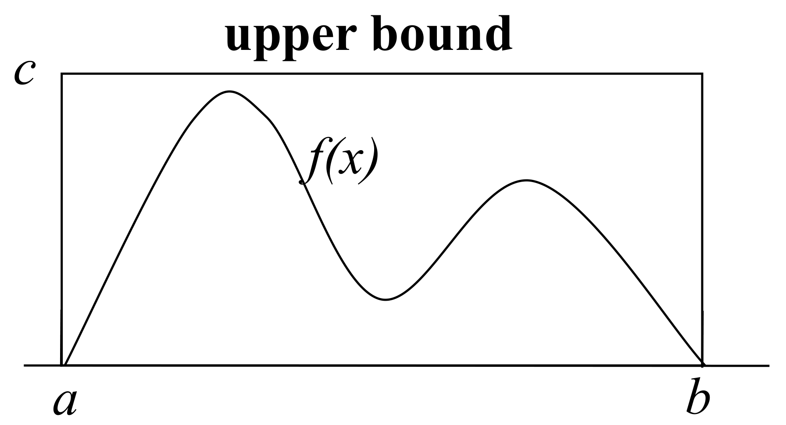
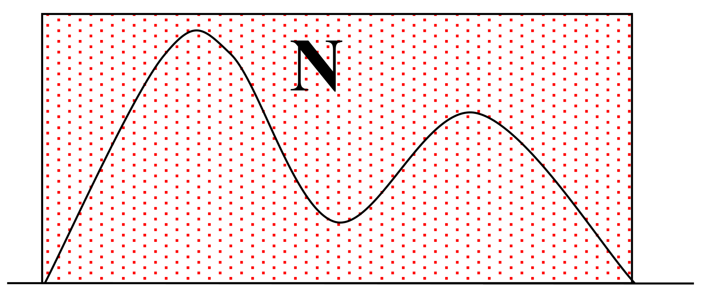
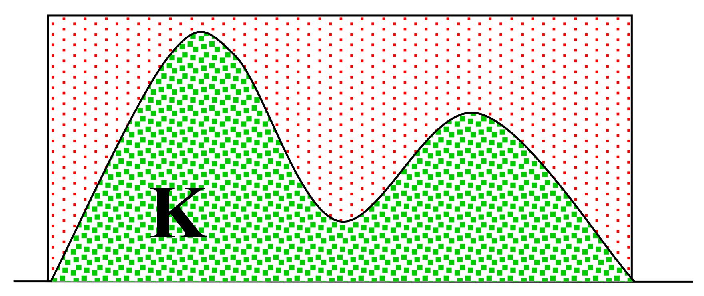

## Overview

### General Concepts

Here are some general concepts of Monte Carlo methods from Wikipedia:

Monte Carlo methods, or Monte Carlo experiments, are a broad class of computational algorithms that rely on repeated random sampling to obtain numerical results. The underlying concept is to use randomness to solve problems that might be deterministic in principle. 

They are often used in physical and mathematical problems and are most useful when it is difficult or impossible to use other approaches. Monte Carlo methods are mainly used in three problem classes: optimization, numerical integration, and generating draws from a probability distribution.

In principle, Monte Carlo methods can be used to solve any problem having a probabilistic interpretation. When the probability distribution of the variable is parametrized, mathematicians often use a Markov chain Monte Carlo (MCMC) sampler. 

### Procedure

Monte Carlo methods generally follow the following steps: 

1. Determine the statistical properties of possible inputs;

2. Generate many ($$N$$) inputs randomly from the distribution which follows the above properties;

3. Perform a deterministic calculation with these sets;

4. Analyze statistically the results.

The error on the results typically decreases as $$\frac{1}{\sqrt{N}}$$.

## Application Examples

Here we introduce some basic and typical applications of Monte Carlo methods.

### Definite Integral 

Monte Carlo integration is the most common application of Monte Carlo methods. While other algorithms usually evaluate the integrand at a regular grid, Monte Carlo randomly chooses points at which the integrand is evaluated. This method is particularly useful for higher-dimensional integrals. 

Suppose we want to compute definite integral of function $f(x)$ from $a$ to $b$, and $c$ is a upper bound of $$f(x)$$ in the interval $$x \in (a,b)$$.

1. The possible inputs are uniformly distributed in the upper bound volume;

   

2. Generate $N$ uniform random samples in upper bound volume;

   

3. Count the $K$ samples that fall below the $f(x)$ curve;

   

4. The estimate of the integral is $$\frac{K}{N} \times \text{Area of upper bound volume} = \frac{K}{N} (b-a)(c-0)$$.

### Expectation Estimation

Suppose we have a random variable $x$ and we want to calculate $$E[g(x)] = \int g(x)f(x) dx$$, where $$g(x)$$ is a known function and $$f(x)$$ is the probability density (or mass) function of $$x$$. Sometimes it is hard to calculate the integral. As a alternative, we use Monte Carlo method.

1. The possible inputs follow the distribution $$f(x)$$;
2. Generate $N$ random samples $$\{x_i\}_{i=1}^N$$ from the distribution $$f(x)$$;
3. Calculate the mean of $$\{g(x_i)\}_{i=1}^N$$ (i.e. $$\frac{1}{N} \sum_{i=1}^N g(x_i)$$);
4. By the law of large number, $$\frac{1}{N} \sum_{i=1}^N g(x_i) \to E[g(x_i)]$$ as $$N \to \infty$$.

## Sampling Methods

Note that we need to generate random samples from a distribution in the step 2 above. Sampling is a key step in Monte Carlo methods. 

### CDF Inversion Sampling

Theatrically, if we can sample from a uniform distribution, we can generate samples from any distribution given the corresponding CDF (cumulative distribution function). 

Denote the CDF of random variable $x$ as $F(x)$. We want to generate samples $$\{x_i\}_{i=1}^N$$ that follow $F(x)$. Let $u$ be a random variable that follows $$\text{Uniform}(0,1)$$. Now we show that the random sample $$x^* := F^{-1}(u)$$ follows the same distribution as $x$:

$$
P(x^* \leq t) = P(F^{-1}(u) \leq t) = P(u \leq F(t)) = F(t).
$$

**Algorithm. CDF Inversion Sampling.** 

[1] For $i=1$ to $N$, execute the steps (a) and (b):

(a) Generate $$u \sim \text{Uniform}(0,1)$$;

(b) Generate a new sample $x_i \in (a_{j-1}, a_j]$ such that $$F(a_{j-1}) < u \leq F(a_{j})$$.

[2] Return samples $$\{x_i\}_{i=1}^N$$. END.

Note that the segment $$(a_{j-1}, a_j]$$ becomes a point as $$N \to \infty$$, and then the (b) step becomes:

(b) Generate a new sample $x_i$ such that $$F(x_i) = u$$. 

### Rejection Sampling

Note that the step (b) in CDF inversion sampling is sometimes difficult. We can use rejection sampling if the PDF (probability density function) is known. 

The idea of rejection sampling is: we do not sample from our target distribution directly (since doing this is hard), instead we sample from a working (or proposal) distribution which is easy to sample from, and then we make some "correction" on the observations sampled from working distribution to get the observations sampled from target distribution. 

If $g(t) > f(t)$, it means that, when we sample from $g(x)$, we have less observations around $t$ than what we should observe if we sample from $f(x)$. Similarly, if $g(t) < f(t)$, we have more. The idea of rejecting is that, we should have a high chance to reject a observation $$x_i$$ if $$g(x_i) > f(x_i)$$, and low chance if $$g(x_i) < f(x_i)$$. 

We may want the chance to be in range of $[0,1]$. Suppose we have a working distribution $g(x)$ and a large constant $M$ such that  $$Mg(x) \geq f(x)$$ for all $x$, then the chance of acceptance can be calculated as $$\frac{f(x_i)}{Mg(x_i)}$$. 

This method indeed works, which can be justified as: $$f(x) = Mg(x) \frac{f(x)}{Mg(x)} \propto g(x) \frac{f(x)}{Mg(x)}$$. The previous equation means we first sample from $g(x)$, then we accept this observation with probability $$\frac{f(x_i)}{Mg(x_i)}$$.

**Algorithm. Rejection Sampling.** 

[1] Repeat the steps (a), (b) and (c) until $i>N$:

(a) Generate $$x_i \sim g(x)$$;

(b) Generate $u \sim \text{Uniform}(0,1)$;

(c) If $$u \leq \frac{f(x_i)}{Mg(x_i)}$$, accept $x_i$ and $i:=i+1$; otherwise reject. 

[2] Return samples $$\{x_i\}_{i=1}^N$$. END. 

## MCMC

### Overview of MCMC

In some circumstances, the probability distribution (either CDF or PDF) is parametrized, and we cannot use the previous methods. Instead, we use a Markov chain Monte Carlo (MCMC) sampler. 

Markov chain Monte Carlo methods create samples from a continuous random variable, with probability density proportional to a known function. 

Why proportional? Notice that, for any PDF $f(x)$, if we know a function (expression is available) that is proportional to PDF $f(x)$, then we know $f(x_0)$ for any $x_0$. That is because, if we know a function that is proportional to $f(x)$, then we know the ratio of $$\frac{f(x_1)}{f(x_2)}$$ for any two $$x_1,x_2$$, then for any point $x_0$, we know $$\frac{f(x)}{f(x_0)}$$ for all $x$. Now if we can calculate the integral $$\int \frac{f(x)}{f(x_0)} dx = \frac{1}{f(x_0)}$$, then we know $f(x_0)$. Note that even when the integral cannot be calculated, we still know the ratio of $$\frac{f(x_1)}{f(x_2)}$$ for any two $$x_1,x_2$$.

The spirit of MCMC is similar to the iterative algorithm, which starts from an arbitrary point and keep updating until reach the convergence. 

The MCMC algorithm constructs a Markov chain. Starting from an arbitrary point, we let the chain run for many steps and then reach the stationary states. Then the points generated by the chain follow the so-called **equilibrium** (or **stationary**) distribution. The key is to specify the chain such that the resulted stationary distribution is our target distribution. 

Various algorithms exist for constructing chains, including the Metropolis-Hastings algorithm. 

### Metropolis-Hastings Algorithm

The Metropolis–Hastings algorithm is a MCMC method for obtaining a sequence of random samples from a probability distribution (e.g. high dimensional distribution) from which direct sampling is difficult. 

The algorithm generate sample values iteratively, with the distribution of the next sample being dependent only on the current sample value (thus making the sequence of samples into a Markov chain). 

Specifically, at each iteration, the algorithm picks a candidate for the next sample value based on the current sample value. Then, with some probability, the candidate is either accepted (in which case the candidate value is used in the next iteration) or rejected (in which case the current value is reused in the next iteration). 

A Markov process is uniquely defined by its transition probabilities $P(x'\mid x)$, the probability of transitioning from any given state $x$ to any other given state $x'$. We separate the transition in two sub-steps: the proposal and the acceptance-rejection. The proposal distribution $g(x'\mid x)$ is the conditional probability of proposing a new state $x'$ given current state $x$, and the acceptance distribution $A(x',x)$ is the probability to accept the proposed state $x'$. The transition probability can be written as the product of them: $$P(x'\mid x) = g(x'\mid x) A(x',x)$$. Note that the ratio $$\frac{f(x')}{f(x_i)}$$ is known since we have a known function that is proportional to $f(x)$.

**Algorithm. Metropolis-Hastings.**

[1] Initialize an initial state $x_0$.

[2] Repeat the steps (a), (b) and (c) until $i>N$:

(a) Generate a random candidate state $x'$ from the proposal distribution $$g(x'\mid x)$$;

(b) Calculate the acceptance probability $$A(x',x_{i})=\min \left(1,{\frac {f(x')}{f(x_{i})}}{\frac {g(x_{i}\mid x')}{g(x'\mid x_{i})}}\right)$$;

(c) Generate $u \sim \text{Uniform}(0,1)$. If $$u \leq A(x',x_{i})$$, then accept the new state and set $x_{i+1} := x'， i:=i+1$. Otherwise reject and do nothing. 

[3] Return samples $$\{x_i\}_{i=1}^N$$. END. 

 

**References:**

[Wikipedia: Monte Carlo method](https://en.wikipedia.org/wiki/Monte_Carlo_method).

Paltani, Stéphane. "[Monte Carlo Methods](https://www.unige.ch/sciences/astro/files/2713/8971/4086/3_Paltani_MonteCarlo.pdf)".

Collins, Robert. "[Intro to Sampling Methods](http://www.cse.psu.edu/~rtc12/CSE586/lectures/samplingPart1.pdf)".

Lecture notes from my professor [Sijian Wang](https://stat.rutgers.edu/people-pages/faculty/people/130-faculty/381-sijan-wang).

[Wikipedia: Metropolis–Hastings algorithm]([https://en.wikipedia.org/wiki/Metropolis%E2%80%93Hastings_algorithm](https://en.wikipedia.org/wiki/Metropolis–Hastings_algorithm)).
