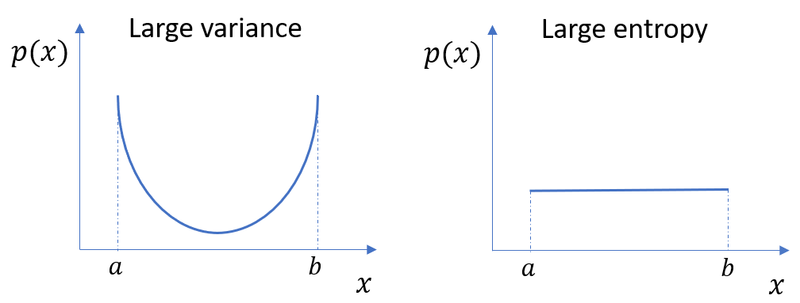

## Upper Bound of Entropy

For a finite sample space, **uniform distribution has maximum entropy among all distributions**.

Given a random variable $$X$$ with sample space $$\mathcal{X}$$ and outcomes $$x \in \mathcal{X}$$. Suppose $$X$$ follows the distribution $$P_X$$. Denote $$\mid\mathcal{X}\mid$$ as the number of elements in the set $$\mathcal{X}$$, 

**Theorem.** $$H(X)\leq\log\mid\mathcal{X}\mid$$. Equality iff $X$ has uniform distribution on $$\mathcal{X}$$.

Proof: 

Denote $$U_{\mathcal{X}}$$ as the uniform distribution on the sample space $$\mathcal{X}$$, then we have $$U_{\mathcal{X}}(x)=\frac{1}{\mid\mathcal{X}\mid}$$.

By the non-negativity of KL divergence, or equivalently by Gibbs' inequality, 

$$\begin{align}
0 &\leq D_{\text{KL}}(P_X \parallel U_{\mathcal{X}}) = \sum_{x \in \mathcal{X}} P_X(x)\log\frac{P_X(x)}{U_{\mathcal{X}}(x)} \\
&= \sum_{x \in \mathcal{X}} P_X(x) \log |\mathcal{X}| - \left(-\sum_{x \in \mathcal{X}} P_X(x)\log P_X(x) \right) \\ 
&= \log |\mathcal{X}| - H(X).
\end{align}$$

Equality iff $$P_X \equiv U_{\mathcal{X}}$$. $$□$$

Note that entropy is different from variance. Variance is the expectation of the squared deviation of a random variable from its mean. Also note that the properties of the entropy of continuous distribution is different from that of discrete distribution.

  

## Principle of Maximum Entropy

Bayesian methods usually need to assume the prior distribution. Naturally we want to avoid inadvertently assuming more knowledge than we actually have, and the **principle of maximum entropy** is the technique for doing this, which states that **the probability distribution which best represents the current state of knowledge is the one with largest entropy**. 

Suppose the outcomes of random variable $X$ are $$\mathcal{X}=\{x_i\}_{i=1}^n$$, then entropy is $$H(X)=-\sum_{i=1}^n P(x_i) \log_b P(x_i)$$. (Common values of the logarithm base $b$ are $2$, and the corresponding units of entropy are the bits for $$b=2$$). Now we want to estimate the probabilities $$P(x_1),P(x_2),\cdots,P(x_n)$$ given $m$ constraints $$\sum_{i=1}^n P(x_i)g_j(x_i)=E\left[g_j(X)\right], j=1,2,\cdots,m$$, where $$g_j(x_i)$$ and $$E\left[g_j(X)\right]$$ are all known for each $$i,j$$.

The **formulation** of maximizing entropy is

$$
P(x_1),\cdots,P(x_n) = \underset{P(x_1),\cdots,P(x_n)}{\text{argmax }} H(X) = \underset{P(x_1),\cdots,P(x_n)}{\text{argmax }} -\sum_{i=1}^n P(x_i) \log_b P(x_i), \\
\begin{align}
\text{subject to } \\
& P(x_i) \geq 0 \text{ for } i=1,\cdots,n, \\ &\sum_{i=1}^{n}P(x_i)=1, \\ 
&\sum_{i=1}^n P(x_i)g_j(x_i)=E\left[g_j(X)\right] \text{ for } j=1,\cdots,m.
\end{align}
$$

We can apply the method of **Lagrange multipliers** to solve this maximization problem. The Lagrangian function is

$$\begin{align}
\mathcal{L}\big(P(x_1),\cdots,P(x_n),\lambda_0,\cdots,\lambda_m\big) = &-\sum_{i=1}^n P(x_i) \log_b P(x_i) + \lambda_0 \left(\sum_{i=1}^{n}P(x_i)-1\right) \\ &+ \sum_{j=1}^{m} \lambda_j \left( \sum_{i=1}^n P(x_i)g_j(x_i) - E\left[g_j(X)\right] \right).
\end{align}$$

Take derivative with respect to $$P(x_i)$$ and set to $$0$$, we have

$$
\frac{\partial \mathcal{L}\big(P(x_1),\cdots,P(x_n),\lambda_0,\cdots,\lambda_m\big)}{\partial P(x_1)} = 0 \implies P^*(x_i) = b^{\lambda_0 - 1 + \sum_{j=1}^m \lambda_jE\left[g_j(X)\right]}.
$$

The Lagrange multipliers $$\lambda_0,\lambda_1,\cdots,\lambda_m$$ are chosen such that

$$
\begin{cases}
\sum_{i=1}^{n}P(x_i)=1, \\
\sum_{i=1}^n P(x_i)g_j(x_i)=E\left[g_j(X)\right] \text{ for } j=1,\cdots,m.
\end{cases}
$$

Since we have $$m+1$$ constraints, and it is equal to the number of Lagrange multipliers, thus we can get the exact solution of $$\lambda_0,\lambda_1,\cdots,\lambda_m$$. 

Note that the logarithm base $b$ does not influence the result. 

## Example: Berger's Burgers

Walker usually buys meals from a fast food restaurant, Berger's Burger, which offers four different meals as shown below:

| Item              | Price  |
| ----------------- | ------ |
| Burger ($$x_1$$)  | $$$1$$ |
| Chicken ($$x_2$$) | $$$2$$ |
| Fish ($$x_3$$)    | $$$3$$ |
| Tofu ($$x_4$$)    | $$$8$$ |

Now Walker tells you that his average cost of each meal is $$$2.5$$. What is the frequency that each item being ordered? We can solve this problem by the technique we discussed in the previous section. 

Denote the item he orders as a random variable $$X$$, which has possible outcomes $$x_1,x_2,x_3,x_4$$. The entropy of $$X$$ is $$H(X)=-\sum_{i=1}^4 P(x_i) \log_2 P(x_i)$$. 

The formulation of maximizing entropy is

$$
P(x_1),\cdots,P(x_4) = \underset{P(x_1),\cdots,P(x_4)}{\text{argmax }} H(X) = \underset{P(x_1),\cdots,P(x_4)}{\text{argmax }} -\sum_{i=1}^4 P(x_i) \log_b P(x_i), \\
\begin{align}
\text{subject to } \\
& P(x_i) \geq 0 \text{ for } i=1,\cdots,4, \\ &\sum_{i=1}^{4}P(x_i)=1, \\ 
& P(x_1)+2P(x_2)+3P(x_3)+8P(x_4)=2.5.
\end{align}
$$

By the method of Lagrange multipliers, we have

$$
P^*(x_1)=2^{\lambda_0 - 1 + \lambda_1}, P^*(x_2)=2^{\lambda_0 - 1 + 2\lambda_1}, P^*(x_3)=2^{\lambda_0 - 1 + 3\lambda_1}, P^*(x_4)=2^{\lambda_0 - 1 + 8\lambda_1}.
$$

Plug these equations into the constraints 

$$
\begin{cases}
P(x_1)+P(x_2)+P(x_3)+P(x_4)=1, \\
P(x_1)+2P(x_2)+3P(x_3)+8P(x_4)=2.5.
\end{cases}
$$

We have two constraints and two variables $$\lambda_0,\lambda_1$$, thus we can get the exact solution: 

$$
\lambda_0 = 1.2371, \lambda_1 = 0.2586.
$$

Plug them back to $$P^*(x_1),\cdots,P^*(x_4)$$ and we have 

$$
P^*(x_1) = 0.3546, P^*(x_2)=0.2964, P^*(x_3)=0.2478, P^*(x_4) = 0.1011.
$$

## Maximum Entropy Classifier

**The maximum entropy classifier is equivalent to logistic regression.** Let's derive logistic regression by maximum entropy to show why they are equivalent.

For $$K$$-class classification problem, denote $k$ as the index of class, vector $$x_i$$ with dimension $$ p \times 1 $$ as the $i$-th observation of the input variables, $$x_i^{(j)}$$ as the $i$-th observation of the $$j$$-th input variable ($j$-th element in vector $$x_i$$), scalar $$y_i$$ as the $i$-th observation of the output variable, and $$\hat{p}_{ik}$$ as the estimated probability of the $i$-th observation is of class $k$. 

Remember that if we optimize logistic regression by maximum likelihood, we can derive the following conclusion: 
$$
\sum_{i=1}^{n} \hat{p}_{ik} x_i^{(j)} = \sum_{i=1}^n \mathbf{1}(y_i=k)x_i^{(j)} \text{ for any } k, j.
$$
We call this equation the "balance equation", which indicates, for any $$k,j$$, the sum of any feature $j$ of training data $x_i$'s in a particular class $k$ is equal to the sum of probability mass the model places in that feature summed across all data. 

In the equivalent maximum entropy derivation of logistic regression we don't have to cleverly guess the sigmoid form. Instead we assume we want the "balance equation" to be true and then we can solve for the form for $$\hat{p}_{ik}$$. 

The entropy of the estimated probabilities $$\hat{p}_{ik}$$'s is $$-\sum_{k=1}^K \sum_{i=1}^n \hat{p}_{ik} \log\hat{p}_{ik}$$.

The formulation of maximizing entropy is 

$$
\hat{p}_{ik}\text{'s} = \underset{\hat{p}_{ik}\text{'s}}{\text{argmax }} -\sum_{k=1}^K \sum_{i=1}^n \hat{p}_{ik} \log\hat{p}_{ik}, \\
\begin{align}
\text{subject to } \\
& \hat{p}_{ik} \geq 0 \text{ for any }i,k, \\ 
& \sum_{k=1}^{K}\hat{p}_{ik}=1, \\ 
& \sum_{i=1}^{n} \hat{p}_{ik} x_i^{(j)} = \sum_{i=1}^n \mathbf{1}(y_i=k)x_i^{(j)} \text{ for any } k, j.
\end{align}
$$

The constraint $$\hat{p}_{ik} \geq 0$$ are hard to work with because it is an inequality instead of an equality, so we leave it out for now and hope that what we find can be shown to satisfy it. 

We still apply the method of Lagrange multipliers to solve this maximization problem. The Lagrangian function is 

$$
\begin{align}
\mathcal{L} \big( \hat{p}_{ik}\text{'s}, \lambda_k^{(j)}\text{'s}, \mu_i\text{'s} \big) 
=  &- \sum_{k=1}^K \sum_{i=1}^n \hat{p}_{ik} \log\hat{p}_{ik} + \sum_{i=1}^{n}\mu_i\left( \sum_{k=1}^{K}\hat{p}_{ik} - 1 \right) \\
&+ \sum_{j=1}^p\sum_{k=1}^{K} \lambda_k^{(j)} \left( \sum_{i=1}^{n} \hat{p}_{ik} x_i^{(j)} - \sum_{i=1}^n \mathbf{1}(y_i=k)x_i^{(j)} \right).
\end{align}
$$

Take derivative of the Lagrangian function with respect to $$\hat{p}_{ik}$$ for all $$i,k$$ and set to $$0$$, we have

$$
\begin{align}
& \frac{\partial \mathcal{L}}{\partial \hat{p}_{ik}} = \sum_{j=1}^p \lambda_k^{(j)} x_i^{(j)} + \mu_i - \log\hat{p}_{ik} - 1 = 0 \\ 
&\implies \hat{p}_{ik} = \exp\left(\sum_{j=1}^p \lambda_k^{(j)} x_i^{(j)} + \mu_i - 1\right)
\end{align}
$$

Denote $$\lambda_k := \left(\lambda_k^{(1)}, \lambda_k^{(2)}, \cdots, \lambda_k^{(p)}\right)^T$$, then 

$$
\hat{p}_{ik} = \exp\left(\lambda_k^T x_i + \mu_i - 1\right).
$$

We can see that this form satisfy the constraint $$\hat{p}_{ik} \geq 0$$.

Now we need to solve for $$\lambda_k$$ and $$\mu_i$$ by the constraints. 

$$
\sum_{k=1}^{K}\hat{p}_{ik} = \sum_{k=1}^{K}\exp\left(\lambda_k^T x_i + \mu_i - 1\right) = 1 \implies e^{\mu_i} = 1 / \sum_{k=1}^{K} e^{\lambda_k^T x_i - 1}.
$$

We then plug it back and simplify to get

$$
\hat{p}_{ik} = \frac{e^{\lambda_k^T x_i}}{\sum_{k=1}^{K} e^{\lambda_k^T x_i}}.
$$

This is exact the softmax function (or multi-category version of the sigmoid function), and thus we showed that the maximum entropy classifier is equivalent to logistic regression.

 

**References:**

Xie, Yao. (2010, Dec 9). *Chain rules and inequalities*. Retrieved June 4, 2020, from https://www2.isye.gatech.edu/~yxie77/ece587/Lecture2.pdf. 

Xie, Yao. (2010, Dec 9). *Maximum entropy*. Retrieved June 6, 2020, from https://www2.isye.gatech.edu/~yxie77/ece587/Lecture11.pdf. 

Paul Penfield, Jr. (2004, Apr 2). *Principle of Maximum Entropy*. Retrieved June 7, 2020, from http://www-mtl.mit.edu/Courses/6.050/notes/chapter9.pdf.

Mount, John. (2011, Sep 23). *The equivalence of logistic regression and maximum entropy models*. Retrieved June 7, 2020, from https://pdfs.semanticscholar.org/19cc/c9e2937b3260ac2c93020174c09c2891672e.pdf.
