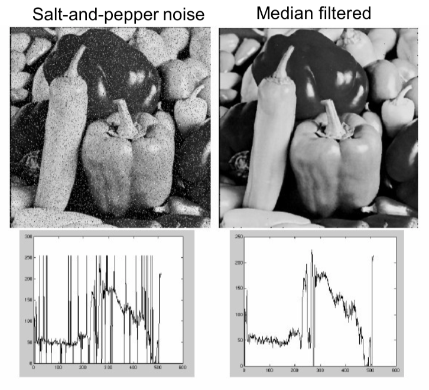

As in one-dimensional signals, images also can be filtered with various low-pass filters (LPF), high-pass filters (HPF), etc. LPF removes high frequency content (eg: noise, edges) from the image. HPF retains high frequency content and helps in finding edges in images. Image smoothing (blurring) is achieved by convolving the image with a LPF kernel. 

## Image Noises

Salt and pepper noise: contains random occurrences of black and white pixels.

Impulse noise: contains random occurrences of white pixels.

Gaussian noise: variations in intensity drawn from a Gaussian normal distribution.

## Moving Average Filter

The moving average filter sets the value of a pixel to be the average of its neighboring pixels. For example, a $$3\times3$$ filter kernel is:

$$
K = \frac{1}{9} \begin{bmatrix} 1 & 1 & 1 \\ 1 & 1 & 1 \\ 1 & 1 & 1 \end{bmatrix}.
$$

This is a box filter and may lead to edge effects (little squares) as shown below.

<figure>

</figure>

To eliminate edge effects, weight contribution of neighborhood pixels according to their closeness to the center, like Gaussian filter.

## Gaussian Filter

The weights in Gaussian filter kernel follows two dimensional Gaussian distribution:

$$
G_{\sigma}=\frac{1}{2 \pi \sigma^{2}} \exp\left(-\frac{x^{2}+y^{2}}{2 \sigma^{2}}\right).
$$

The standard deviation $$\sigma$$ determines extent of smoothing. We usually set filter half-width to about $$3\sigma$$. Smoothing with larger std. dev. or larger kernel width suppresses noise, but also blurs the image. If you need more detail for the follow-up task, use a smaller std. dev. or kernel width. Otherwise, if you need only a rough sketch and the details are noise for the follow-up task, use a larger one.

<figure>

<figcaption style="font-size: 80%;"> Figure. 3D structure, 2D structure and example of filter (a) Box filter (b) Gaussian filter and (c) Laplace filter. (<a href="https://towardsdatascience.com/image-processing-class-egbe443-4-filters-aa1037676130">Source</a>)</figcaption>
</figure>

Gaussian filter has several amiable properties.

**Convolution with self is another Gaussian.** So Gaussian filter can smooth with small $$\sigma$$ kernel, repeat, and get same result as larger $$\sigma$$ kernel would have. Also, convolving two times with Gaussian kernel with std. dev. $$\sigma$$ is same as convolving once with kernel with std. dev. $$\sqrt{2}\sigma$$. 

**Separability of the Gaussian filter.** The 2D Gaussian can be expressed as the product of two functions, one a function of $$ x $$ and the other a function of $$ y $$. In this case, the two functions are the (identical) 1D Gaussian. 

$$
\begin{aligned}
G_{\sigma}(x, y) &=\frac{1}{2 \pi \sigma^{2}} \exp \left({-\frac{x^{2}+y^{2}}{2 \sigma^{2}}} \right)\\
&=\left(\frac{1}{\sqrt{2 \pi} \sigma} \exp ^{-\frac{x^{2}}{2 \sigma^{2}}}\right) \cdot \left(\frac{1}{\sqrt{2 \pi} \sigma} \exp ^{-\frac{y^{2}}{2 \sigma^{2}}}\right).
\end{aligned}
$$

Why is separability useful? The complexity of filtering an $$n \times n$$ image with an $$m \times m$$ kernel is $$O(n^2 m^2)$$. If the kernel is separable, the complexity is $$O(n^2m)$$. A disadvantage of separation is that it requires an extra ram memory to store the intermediate image, which can be a concern in certain applications.

Both moving average filter and Gaussian filter are linear filters. 

Gaussian smoothing is highly effective in removing Gaussian noise from an image.

## Medium Filter 

Medium filter takes the median of all the pixels under the kernel area and replaces the central pixel with this median value. 

Medium filter is robustness to outliers and hence it is highly effective against salt-and-pepper noise and impulse noise in an image, as shown in plots below below. Note that medium filter is a non-linear filter.

  

## Bilateral Filtering

The previous filters may blur edges a bit in this after smoothing, but bilateral filtering is effective in noise removal while keeping edges sharp. 

<figure>

<figcaption style="font-size: 80%;"> Figure. Comparision of median filter and bilateral filter. (<a href="http://people.csail.mit.edu/sparis/bf_course/slides08/04_applications_simple_bf.pdf">Source</a>)</figcaption>
</figure>

Bilateral filtering also takes a Gaussian filter in space, but one more Gaussian filter which is a function of pixel difference. The Gaussian function of space makes sure that only nearby pixels are considered for blurring, while the Gaussian function of intensity difference makes sure that only those pixels with similar intensities to the central pixel are considered for blurring. So it preserves the edges since pixels at edges will have large intensity variation.

An image has two main characteristics: the space domain $$ \mathcal{S} $$, which is the set of possible positions in an image; the range domain $$ \mathcal{R} $$, which is the set of possible pixel values. Denote a gray-scale image as $$ I $$, and the $$ 2 \mathrm{D} $$ pixel position as $$ \mathbf{p}=\left(p_{x}, p_{y}\right) $$  or $$ \mathbf{q}=\left(q_{x}, q_{y}\right) $$, and the pixel intensity at position $$\mathbf{p}$$ as $$I_{\mathbf{p}}$$. We have $$\mathbf{p} \in  \mathcal{S} $$ and $$I_{\mathbf{p}} \in  \mathcal{R} $$.

Denote $$z=\sqrt{x^2+y^2}$$, then the Gaussian kernel can be written as 

$$
G_{\sigma}(z) = \frac{1}{2 \pi \sigma^{2}} \exp\left(-\frac{z^2}{2 \sigma^{2}}\right).
$$

One defines the Gaussian blur (GB) filtered image by

$$
G B[I]_{\mathbf{p}}=\sum_{\mathbf{q} \in \mathcal{S}} G_{\sigma}(\|\mathbf{p}-\mathbf{q}\|) I_{\mathbf{q}}.
$$

So, Gaussian filtering is a weighted average of the intensity of the adjacent positions with a weight decreasing with the spatial distance to the center position $$ \mathbf{p} $$. This distance is defined by $$ G_{\sigma}(\|\mathbf{p}-\mathbf{q}\|) $$.

Similarly to the Gaussian convolution, the bilateral filter is also defined as a weighted average of pixels. The difference is that the bilateral filter takes into account the variation of intensities to preserve edges. The rationale of bilateral filtering is that two pixels are close to each other not only if they occupy nearby spatial locations but also if they have some similarity in the photometric range.

The bilateral filter, denoted by $$ B F[\cdot], $$ is defined by

$$
BF[I]_{\mathbf{p}} = \frac{1}{W_{\mathbf{p}}} \sum_{\mathbf{q} \in \mathcal{S}} G_{\sigma_{s}}(\|\mathbf{p}-\mathbf{q}\|) G_{\sigma_{r}}\left(I_{\mathbf{p}}-I_{\mathbf{q}}\right) I_{\mathbf{q}}, \tag{*}
$$

where $$ W_{\mathbf{p}} $$ is a normalization factor:

$$
W_{\mathbf{p}}=\sum_{\mathbf{q} \in \mathcal{S}} G_{\sigma_{s}}(\|\mathbf{p}-\mathbf{q}\|) G_{\sigma_{r}}\left(I_{\mathbf{p}}-I_{\mathbf{q}}\right).
$$

Parameters $$ \sigma_{s} $$ and $$ \sigma_{r} $$ will measure the amount of filtering for the image $$I$$. Equation (*) is a normalized weighted average where $$ G_{\sigma_{s}} $$ is a spatial Gaussian that decreases the influence of distant pixels, $$ G_{\sigma_{r}} $$ a range Gaussian that decreases the influence of pixels $$ \mathbf{q} $$ with an intensity value different from $$ I_{\mathrm{p}} $$. Note that the term range qualifies quantities related to pixel values, by opposition to space which refers to pixel location. 

<figure>

<figcaption style="font-size: 80%;"> Figure. Bilateral Filter on a Height Field. (<a href="http://people.csail.mit.edu/sparis/bf_course/slides08/03_definition_bf.pdf">Source</a>)</figcaption>
</figure>

The bilateral filter is controlled by two parameters: $$\sigma_{r}$$ and $$\sigma_{r}$$. 

- As the range parameter $$ \sigma_{r} $$ increases, the bilateral filter becomes closer to Gaussian blur because the range Gaussian is flatter, i.e., almost a constant over the intensity interval covered by the image.

- Increasing the spatial parameter  $$ \sigma_{s} $$ smooths larger features.

The figure below illustrates their effects. As soon as one of the weight is close to $$0$$, no smoothing occurs. As a consequence, increasing the spatial sigma has no consequence on a edge as long as the range sigma is less than its amplitude. For instance, the contour of the roof is unaffected for small range values, independently of the spatial setting. The range values are given considering that the intensities span $$[0,1]$$.

<figure>

<figcaption style="font-size: 80%;"> Figure. Effects of the range and spatial parameters, and comparison with Gaussian blur. (<a href="http://people.csail.mit.edu/sparis/bf_course/course_notes.pdf">Source</a>)</figcaption>
</figure>

An important characteristic of bilateral filtering is that the weights are multiplied, which implies that as soon as one of the weight is close to 0, no smoothing occurs. As an example, a large spatial Gaussian coupled with narrow range Gaussian achieves a limited smoothing although the filter has large spatial extent. The range weight enforces a strict preservation of the contours.

 

**References:**

[OpenCV-Python Tutorials: Smoothing Images](https://docs.opencv.org/master/d4/d13/tutorial_py_filtering.html)

[CS376 - Computer Vision: Linear Filters](https://www.cs.utexas.edu/~huangqx/CS376_Lecture_2.pdf)

[A Gentle Introduction to Bilateral Filtering and its Applications](http://people.csail.mit.edu/sparis/bf_course/#material)