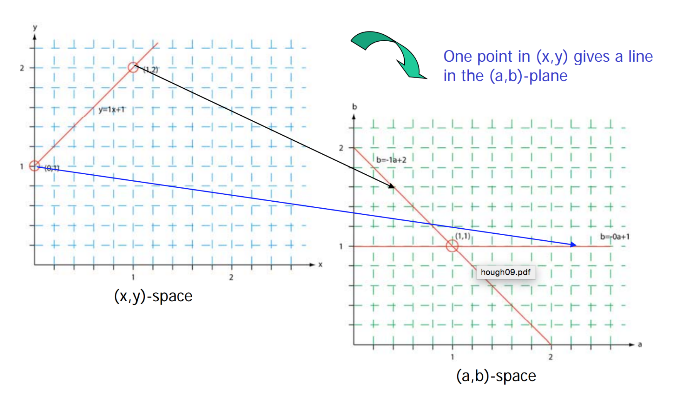
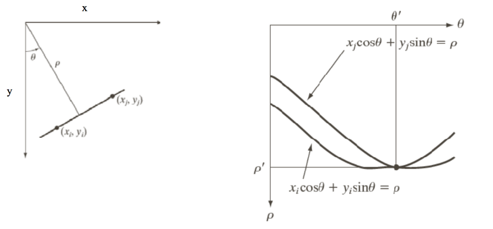

Hough transform can be used to detect any structure whose paramteric equation is known. For example, detecting lines or circles in a image. It gives a robust detector under noise and partial occlusion.

### Goal of Hough Transform for Detecting Lines

Hough transform can be used to detect lines in a image. To do this, we want to locate sets of pixels that make up straight lines in the image. This works to detect lines in an image after an edge detector is applied to get the pixels of just the edges.

### Detecting Lines Using Hough Transform in $$a, b$$ Space

Say we have a $$(x_i, y_i)$$. There are infinite lines that could pass through this point. We can define a line that passes through this pixel $$(x_i, y_i)$$ as $$y_i = ax_i + b.$$ Using this, we can transform each pixel into $$a,b$$ space by rewriting this equation as: $$b = -ax_i + y_i$$.

This equation represents a line in $$a,b$$ space, and each $$a,b$$ point on the line represents a possible line in $$x,y$$ space passing through our point $$x_i,y_i$$. Thus, for each pixel $$x_i,y_i$$ in our set of edge pixels, we transform it into $$a,b$$ space to get a line. 

<figure>

<figcaption style="font-size: 80%;"> Figure. The transformation from the
original (x,y) space to (a,b) space. (<a href="https://github.com/StanfordVL/cs131_notes/blob/master/lecture06/lecture06.pdf">Source</a>) </figcaption>
</figure>

An arbitrary point $$(x_i,y_i)$$ in $$x,y$$ space correspond to a line $$b = -ax_i + y_i$$ in $$a,b$$ space, and any line $$y=a_ix+b_i$$ in $$x,y$$ space correspond to a point $$(a_i,b_i)$$ in $$a,b$$ space. 

The intersection of lines in $$a,b$$ space represent the $$a,b$$ values that compromise a line $$y_i = ax_i + b$$ passing through those points.

Example: Say we have two points $$x_1,y_1 = (0,1)$$, and $$x_2,y_2 = (1,2)$$. We transform these points into $$a,b$$ space with the lines $$b = 0 \times a + 1$$ and $$b = -1 \times a + 2$$. Solving for the intersection of these two lines gives us $$a=1$$ and $$b=1$$. This intersection point in $$(a,b)$$ space gives us the values for the line that goes through both points in $$x,y$$ space: $$y=1 \times x + 1$$.

### Hough Transform in $$\rho, \theta$$ Space

A problem with using $$a,b$$ space to represent lines is that they are limited and cannot represent vertical lines. To solve this, we use polar coordinates to represent lines. 

We can define a line that passes through this pixel $$(x_i, y_i)$$ as $$\rho = x_i\cos\theta + y_i\sin\theta$$, where $$\rho$$ is the perpendicular distance from the origin to the line, and $$\theta$$ is the angle formed by this perpendicular line and the axis. Using this, we can transform each pixel $$(x_i,y_i)$$ into $$\rho, \theta$$ space by $$\rho = x_i\cos\theta + y_i\sin\theta$$.

In $$\rho, \theta$$ space, points are not represented as lines but instead as sine wave-like functions. A curve $$\rho = x_i\cos\theta + y_i\sin\theta$$ in $$\rho, \theta$$ space represents all straight lines that cross the point $$(x_i, y_i)$$ in $$x, y$$ space. 

<figure>

<figcaption style="font-size: 80%;"> Figure. The transformation from the
original (x,y) space to (\rho,\theta) space. (<a href="https://github.com/StanfordVL/cs131_notes/blob/master/lecture06/lecture06.pdf">Source</a>) </figcaption>
</figure>

An arbitrary point $$(x_i,y_i)$$ in $$x,y$$ space correspond to a curve $$\rho = x_i\cos\theta + y_i\sin\theta$$ in $$\rho,\theta$$ space, and any line $$\rho_i = x\cos\theta_i + y\sin\theta_i$$ in $$x,y$$ space correspond to a point $$(\rho_i,\theta_i)$$ in $$\rho,\theta$$ space. 

The intersection of these curves in $$\rho, \theta$$ space still correspond to the $$\rho, \theta$$ that comprise a line passing through those points. In the previous figure , the $$(\rho, \theta)$$ in left plot equals to the $$(\rho', \theta')$$ in right plot. The straight line in left plot that
crosses points $$(x_i, y_i)$$ and $$(x_j, y_j)$$ can be expressed as $$x\cos\theta' + y\sin\theta' = \rho'$$ in $$x, y$$ space.

### Accumulator Cells

For each pixel $$x_i, y_i$$ we transform it into a function in $$\rho, \theta$$ space. We apply the accumulator cell to count the most intersections (votes) of functions. We quantize our $$\rho, \theta$$ space into cells, and add a "vote" to each cell that our function passes through. The cells with the most votes are the most likely real lines in our image. Cells receiving more than a threshold are assumed to correspond to lines in original $$x,y$$ space. 

<figure>

<figcaption style="font-size: 80%;"> Figure. Hough transform example result. (<a href="https://en.wikipedia.org/wiki/Hough_transform">Source</a>) </figcaption>
</figure>

**Algorithm. Hough transform.**

For each edge point $$(x_i,y_i)$$:

&nbsp; # Traverse through the curve $$\rho = x_i\cos\theta + y_i\sin\theta$$ and vote

&nbsp; For $$\theta$$ in Range($$-\pi, \pi$$) with the grid size as step size:

&nbsp; &nbsp; $$\rho = x_i\cos\theta + y_i\sin\theta$$

&nbsp; &nbsp; $$H(\rho, \theta) \mathrel{+}= 1$$ \# vote

End

When applying Hough transform in $$\rho, \theta$$ space, it is useful to make use of gradient information which is often available as output from an edge detector. For example, if we know the direction of the edge point is $$\theta'$$, then this point votes for $$\theta'-\frac{\pi}{8} \sim \theta' + \frac{\pi}{8}$$ in $$\rho, \theta$$ space. This reduces the computation time and has the effect of reducing the number of useless votes. This modified Hough transform can be expressed as

**Algorithm. Modified Hough transform.**

For each edge point $$(x_i,y_i)$$:

&nbsp; $$\theta'$$ = gradient orientation at $$(x_i,y_i)$$

&nbsp; For $$\theta$$ in Range($$\theta'-\frac{\pi}{8}, \theta' + \frac{\pi}{8}$$) with the grid size as step size:

&nbsp; &nbsp; $$\rho = x_i\cos\theta + y_i\sin\theta$$

&nbsp; &nbsp; $$H(\rho, \theta) \mathrel{+}= 1$$ \# voting

End

### Dealing with Noise

Here are several methods to deal with noise in Hough transform.

Choosing a good grid (discretization). If the grids are too coarse, then large votes obtained when too many different lines correspond to a single bucket. Otherwise, if too fine, miss lines because some points that are not exactly collinear cast votes for different buckets.

Increment neighboring bins (smoothing in accumulator array). Trying to get rid of irrelevant features: taking only edge points with significant gradient magnitude.

### Concluding Remarks

Advantages of the Hough Transform:

- It is conceptually simple (just transforming and finding intersection in Hough space), and it is also fairly easy to implement;
  
- It can handle missing and occluded data well;

- It can find other structures other than lines, as long as the structure has a parametric equation;
  
- It can fit multiple instances of a model (e.g. there are multiple lines in the image).

Disadvantages:

- It gets more computationally complex the more parameters you have;

- It can also only look for one kind of structure (so not lines and circles together);
  
- The length and the position of a line segment can also not be detected by this. It can be fooled by "apparent" lines, and co-linear line segments cannot be separated.

 

**References:**

[CS131 - Computer Vision: Lecture 6](https://github.com/StanfordVL/cs131_notes/blob/master/lecture06/lecture06.pdf)

[Wikipedia: Hough transform](https://en.wikipedia.org/wiki/Hough_transform)

